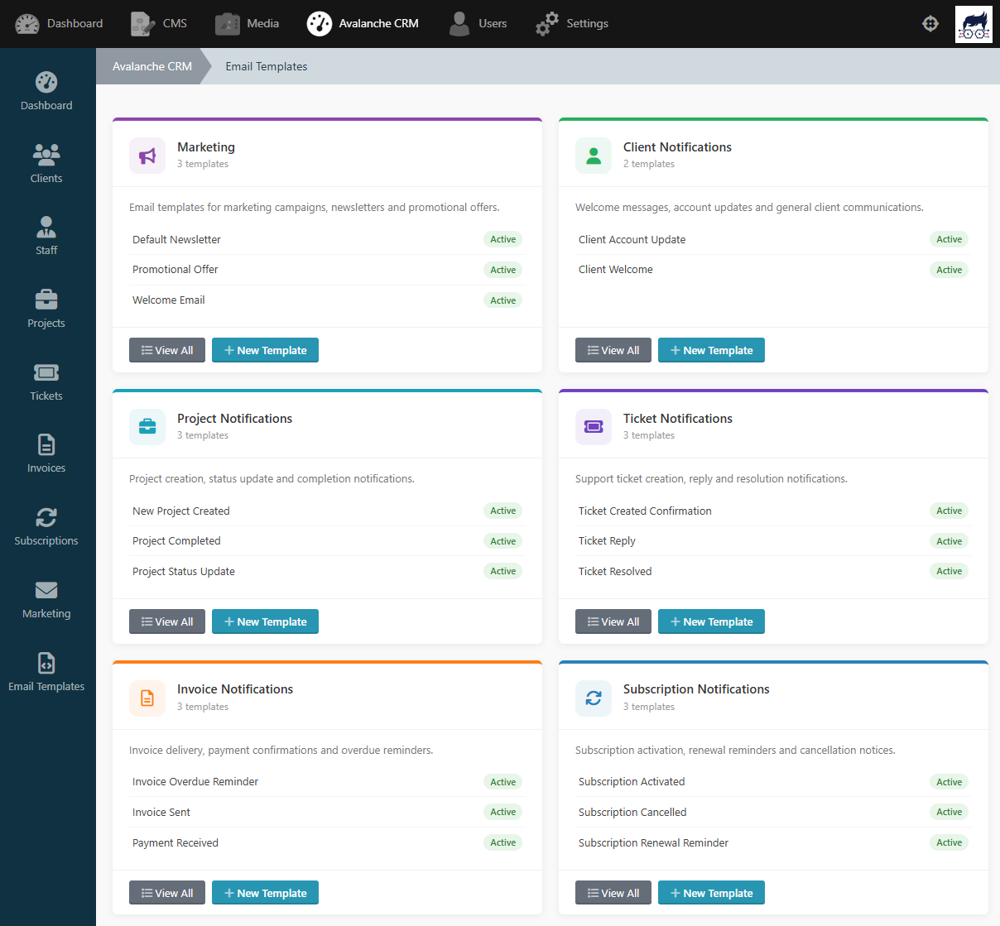

# Avalanche CRM

A powerful, comprehensive Customer Relationship Management (CRM) and Billing system for Winter CMS. Streamline your client management, project tracking, invoicing, support tickets, and recurring subscriptions directly within your CMS.


> [!WARNING]
> **Work In Progress**: This plugin is currently in early development. Features, database structures, and components are subject to significant changes without prior notice. Use in production at your own risk.

## Key Features

*   **👥 Client Management**: Centralised tracking of client details, associated user profiles, and activity.
*   **🏗️ Projects & Tasks**: Robust project management with assignable tasks, staff roles, and Kanban-style management.
*   **🧾 Professional Invoicing**:
    *   Automatic PDF generation via DomPDF.
    *   Curated tax calculations and customisable currency symbols.
    *   Managed invoice status (Outstanding, Paid, etc.).
*   **🎫 Support Tickets**: Integrated client-facing ticket system with categories, priority levels, and status tracking.
*   **🔄 Subscriptions & Billing**: 
    *   Recurring billing management for various plans.
    *   Support for multiple payment gateways (Stripe, PayPal, GoCardless).
    *   Managed billing cycles and payment methods.
*   **🛠️ Staff Management**: Manage internal team members, job titles, and departments.
*   **🎨 Dynamic Theming**: Built-in CSS variables for brand-specific dashboard customisation.
*   **🇬🇧 UK English Localisation**: Full support for UK English conventions (e.g., "Cancelled", "Synchronise").

## Settings

Avalanche CRM provides a settings area in the Winter CMS backend to configure:

*   **Company Details**: Set your business name, address, contact information, and logo for use on generated PDFs.
*   **Billing & Currency**: Define your default currency symbol, tax percentage, and invoice numbering formats.
*   **Payment Gateways**: Configure API credentials for Stripe, PayPal, and GoCardless to enable automated payment processing.
*   **Support & Tickets**: Manage ticket categories, priority levels, and automated status transitions.
*   **Custom Branding**: Adjust dashboard accent colours and UI elements via built-in CSS variable controls.


## Email Templates

Avalanche CRM provides a settings area in the Winter CMS backend to manage email templates:

*   **Invoice Notifications**: Automated emails for new invoices, payment reminders, and receipts.
*   **Ticket Updates**: Instant notifications for ticket creation, staff replies, and status changes.
*   **Subscription Alerts**: Automated messages for renewals, cancellations, and payment failures.
*   **Dynamic Variables**: Personalise templates using placeholders for client names, invoice amounts, and ticket IDs.



## Requirements

*   Winter CMS 1.1.x or higher
*   Winter.User Plugin
*   Winter.UserPlus Plugin
*   Winter.Location Plugin
*   Stripe PHP SDK
*   GoCardless Pro PHP SDK
*   PHP `dompdf` extension

## Installation

1.  Install plugin with composer:
    ```bash
    composer require thewebsiteguy/wn-avalanchecrm-plugin
    ```
2.  Execute migrations:
    ```bash
    php artisan winter:up
    ```

## Frontend Components

This plugin provides several components to build a fully functional client portal:

### 🎫 tickets
Allows clients to view, create, and manage their support tickets.
```ini
[tickets]
ticketsPerPage = 10
allowCreate = 1
allowClose = 1
```

### 🏗️ projects
Displays projects assigned to the client, including tasks, tickets, and invoices.
```ini
[projects]
projectsPerPage = 10
showTasks = 1
```

### 📑 invoices
Provides a list of sent invoices with PDF download capability.
```ini
[invoices]
invoicesPerPage = 10
```

### 🔄 subscriptions
Comprehensive subscription management including plan switching and payment method updates.
```ini
[subscriptions]
showPlans = 1
showPaymentMethods = 1
```

### 👤 account
Allows users to manage their profile details and contact information.
```ini
[account]
```

## Configuration

Navigate to **Settings > CRM > Avalanche CRM Settings** to configure:
*   **Currency Settings**: Custom symbols and codes (e.g., £ GBP).
*   **Brand Styling**: Primary and secondary colours for the client portal.
*   **Invoicing**: Set your company details and invoice prefixes.
*   **Payment Gateways**: API credentials for Stripe, PayPal, and GoCardless.

## Localisation

The plugin is fully internationalised. To change the language, set your Winter CMS locale. UK English is supported out-of-the-box via the `en-gb` locale.

## Permissions

Registers granular permissions for:
*   `access_clients` - Manage client database.
*   `access_projects` - Manage projects and tasks.
*   `access_tickets` - Manage support desk.
*   `access_invoices` - Generate and manage billing.
*   `access_settings` - System-wide configuration.

## Support

For technical support or feature requests, please contact [TheWebsiteGuy](mailto:support@thewebsiteguy.uk).

---
*Built with ❤️ for the Winter CMS Community.*
